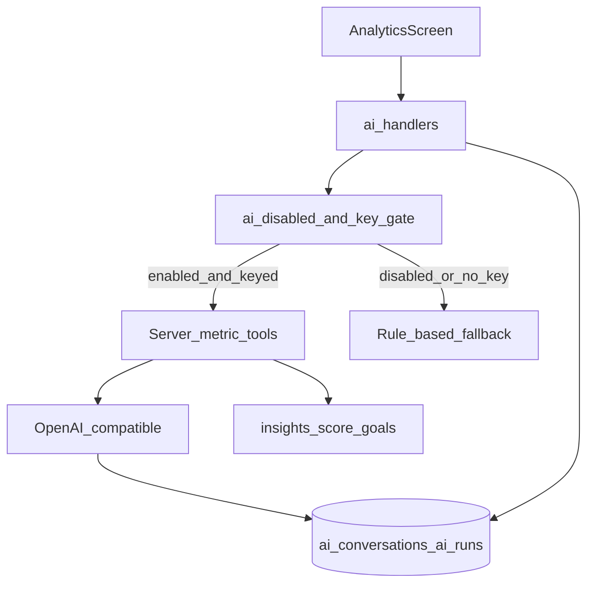

# Lony AI Personas Roadmap

**Purpose:** Sequence the build of three LLM-backed advisors — **Analyst**, **Visualizer**, and **Coach** — on top of the deterministic Insights / Trust stack that already ships.

**Status:** Epics L0–L4 shipped. Coach action chips wired on mobile **and** web; admin overview includes jobs/FX; Plaid sync into cashflow shipped. Soft polish: richer Insights/Visualizer charts.

**Related:** Product overview and non-AI phases live in [`FINANCIAL_TRACKER_ROADMAP.md`](./FINANCIAL_TRACKER_ROADMAP.md). This file is the source of truth for LLM work only.

---

## 1. Product personas

| ID | Name | Job | Primary UI |
|----|------|-----|------------|
| AI-1 | **Analyst** | Trends, anomalies, patterns; narrative over ledger metrics | Insights → Analysis cards |
| AI-2 | **Visualizer** | Period report packs: chart specs + captions + tables | Insights → Reports |
| AI-3 | **Coach** | Conversational advice: gaps, priorities, next actions | Insights → Coach (chat thread) |

**Lony Trust (A–E)** stays **deterministic**. The LLM may *explain* score components; it must not invent or replace the grade.

---

## 2. What already exists

| Piece | Location | Notes |
|-------|----------|--------|
| Deterministic insight cards | `apps/api/internal/ai/service.go` | `RefreshInsights` rules |
| Keyword Coach | same | Pattern-match replies + action hints |
| Analytics report | `POST /ai/analytics/report` | Structured, non-LLM |
| Mobile Insights tabs | `apps/mobile/src/AnalyticsScreen.tsx` | Overview, cashflow, debts, goals, analysis, coach |
| Disclaimer on every AI surface | mobile + API | Always shown |
| Clear AI history | `POST /ai/insights/clear` | User-initiated |
| Admin global kill switch | `platform_settings.ai_disabled` | `POST /admin/settings/ai` |
| Metric APIs for tools | `/insights/*`, `/score`, `/goals` | Feature sources |

---

## 3. Non-negotiable policies

1. **Never** send raw bank account numbers, payment identifiers, or full statement CSVs to the model — only aggregated metrics from server tools.
2. **Disclaimer** on every AI response (reuse existing copy).
3. Coach **must not** suggest borrowing more / taking new peer loans to “fix” cashflow — focus on repayment, savings, budgets, goals.
4. Refuse: illegal debt collection, guaranteed returns, “what’s my official credit score.”
5. Honor **admin AI disable** and missing API keys by falling back to rule-based paths (or a clear `AI_UNAVAILABLE`).
6. Transcripts included in **export** and wiped on **account delete**.

---

## 4. Provider decision (locked for v1)

**OpenAI-compatible HTTP API.**

| Env var | Purpose |
|---------|---------|
| `OPENAI_API_KEY` | Required for LLM paths |
| `OPENAI_BASE_URL` | Optional; default OpenAI; set for compatible proxies |
| `OPENAI_MODEL` | Default `gpt-4o-mini` (cheap, tool-capable) |
| `AI_DAILY_USER_CAP` | Max LLM requests per user per UTC day (default e.g. 40) |

Works with OpenAI and any OpenAI-compatible endpoint without rewriting the client.

---

## 5. Target architecture

```text
Mobile (Insights)
    │
    ▼
AI handlers (chi) ──► ai_disabled / no key? ──► rule-based (today)
    │
    ▼
Tool layer (server-only) ──► insights / score / goals / debts
    │
    ▼
LLM client (OpenAI-compatible) ──► ai_runs / ai_conversations / ai_messages
```



---

## 6. Shared platform — Epic L0

Build once; every persona depends on this.

### 6.1 Config & client

- Add env vars to `apps/api/.env.example` and `apps/api/internal/config`.
- Package `apps/api/internal/ai/llm`: chat completions (+ optional tools / streaming later).
- If `OPENAI_API_KEY` empty → LLM paths unavailable; existing rule Coach/insights still work.

### 6.2 Server tools (no user SQL to the model)

| Tool | Backing data |
|------|----------------|
| `get_overview` | `/insights/overview` metrics |
| `get_category_spend` | category breakdown |
| `get_cashflow_series` | month series |
| `get_goals` | goals + progress |
| `get_debts` | debt / loan summary |
| `get_score_components` | Trust breakdown |

Tools run **only** for the authenticated user id from the request context.

### 6.3 Data model

New migration (e.g. `00030_ai_llm.sql`):

- `ai_conversations` — `id`, `user_id`, `persona` (`analyst` \| `visualizer` \| `coach`), `title`, timestamps  
- `ai_messages` — `conversation_id`, `role` (`user` \| `assistant` \| `system` \| `tool`), `content`, `citations` JSONB, `created_at`  
- `ai_runs` — `user_id`, `persona`, `kind`, `input_summary`, `output_summary`, `model`, `prompt_tokens`, `completion_tokens`, `status`, `created_at`  
- Optional: `ai_usage_daily` — `(user_id, day)` → `request_count` for caps  

### 6.4 Privacy & admin

- Extend privacy export/delete to cover conversations + runs.
- Keep admin kill switch; optionally expose usage counts later (L4).

### 6.5 Contract

- OpenAPI paths for new coach thread endpoints and any report/insight LLM flags.
- Document env vars in README / runbook briefly.

### Exit criteria (L0)

- [x] With a key: smoke completion succeeds in a unit/integration test or manual curl.
- [x] Without a key: Coach and insights refresh still succeed via rules.
- [x] Tools return JSON free of payment identifiers.

---

## 7. Analyst — Epic L1

**Job:** Human-readable narratives on top of deterministic cards (rules first, LLM second).

### Steps

1. Keep rule generation in `RefreshInsights`.
2. When LLM available, pass a **feature snapshot** (metrics + rule cards) to the model; enrich `body` / optional title; preserve `theme`, `severity`, evidence ids.
3. Persist `ai_runs` with `persona=analyst`.
4. Mobile Analysis tab: badge when card is LLM-enriched (optional).

### API

- Stay on `POST /ai/insights/refresh` — auto-use LLM when keyed, or `?llm=1` / body flag.

### Exit criteria (L1)

- [x] Refresh yields narratives that cite metric ids (e.g. category MoM).
- [x] Works offline-of-LLM via rules only.

---

## 8. Visualizer — Epic L2

**Job:** Period report packs. Charts are **client-rendered from JSON**, never model-drawn images.

### Steps

1. Upgrade `POST /ai/analytics/report`:
   - Input: `currency`, `months`
   - Pipeline: tools → numbers → LLM captions/summary
   - Output: `{ charts, captions, tables, summary, disclaimer }`
2. Mobile: Reports block under Insights renders existing bar/series widgets from chart specs + captions.
3. “Explain this” deep-link opens Coach with a context payload (chart id + period).

### Exit criteria (L2)

- [x] Report numbers match Insights APIs for the same period.
- [x] Captions are short and disclaimer-backed.

---

## 9. Coach — Epic L3

**Job:** Multi-turn advice grounded in tools, with action chips.

### Steps

1. Replace keyword `Coach` with LLM + tools; keep keyword/rules as fallback.
2. Persist one open thread per user for `persona=coach` (or list threads later).
3. System prompt priorities: emergency fund, high-interest / overdue debt, goal deadlines, budgets; **never** recommend new borrowing.
4. Response shape: `{ reply, disclaimer, actions[], citations[] }`.
5. Action chips deep-link: create budget, open goal, log expense, open accounts, reconcile.
6. Mobile: real chat history UI (not single Q&A).

### API (target)

| Method | Path | Notes |
|--------|------|--------|
| GET | `/ai/coach/thread` | Current thread + messages |
| POST | `/ai/coach/messages` | User message → assistant reply |
| POST | `/ai/coach/thread/clear` | Optional; or reuse insights clear pattern |
| POST | `/ai/coach/messages/stream` | **L3b** SSE streaming |

### Exit criteria (L3)

- [x] Multi-turn history persists and exports.
- [x] Tool-grounded answers when keyed; fallback when not.
- [x] No “borrow more” suggestions in prompt + light output filter.

### L3b — Streaming (same epic if time)

- [x] SSE (or chunked) assistant tokens for Coach only.
- [x] Mobile: append tokens to the last bubble.

---

## 10. Safety, cost, polish — Epic L4

1. Enforce `AI_DAILY_USER_CAP` in AI handlers.
2. Red-team / eval: 5–10 fixture users; assert citations present (not exact prose).
3. Admin: optional AI request counters.
4. Update this file + [`FINANCIAL_TRACKER_ROADMAP.md`](./FINANCIAL_TRACKER_ROADMAP.md) §21 when LLM ships.
5. Soft: richer Insights charts driven by Visualizer specs.

### Exit criteria (L4)

- [x] Cap returns `429` / clear error after limit.
- [x] Eval suite runs in CI or `go test` with mocked LLM.

---

## 11. Build order

| Order | Epic | Focus | Rough effort |
|-------|------|--------|--------------|
| 1 | **L0** | Config, LLM client, tools, tables, privacy | 1–2 days |
| 2 | **L1** | Analyst enrich on refresh | ~1 day |
| 3 | **L3** | Coach chat (non-stream) + mobile thread | 1–2 days |
| 4 | **L2** | Visualizer report + mobile reports | ~1 day |
| 5 | **L3b + L4** | Streaming, caps, evals, docs | ~1 day |

**Recommended start:** Epic L0, then L1 and L3 in parallel only if two people; otherwise L0 → L1 → L3 → L2 → L4.

---

## 12. Out of scope

- Training or fine-tuning custom models  
- Sending raw statements / bank IDs to the LLM  
- Replacing deterministic Trust with an LLM grade  
- Live open banking / Plaid (separate track)  
- Peer-facing AI that sees another user’s ledger  

---

## 13. Checklist — shipped when

- [x] L0 platform live in API  
- [x] L1 Analyst LLM enrich  
- [x] L2 Visualizer report  
- [x] L3 Coach multi-turn  
- [x] L3b streaming (optional but desired)  
- [x] L4 caps + eval + roadmap updated  
- [x] Keys documented; kill switch verified  

---

## 14. Immediate next action

Core personas shipped (including Coach chips on mobile; web chips wired to product routes). Plaid Link **and** transaction sync into cashflow are shipped (`POST /bank-links/{id}/sync`) — set `PLAID_*` + `PUBLIC_BASE_URL` to use live bank connect; CSV import remains the default without Plaid.

**Still soft / deferred:** richer Visualizer charts; fuller i18n string coverage; optional per-persona model overrides.

---

*Living doc: update checklists as epics ship. Do not duplicate non-AI tracker work here — link the financial tracker roadmap instead.*
